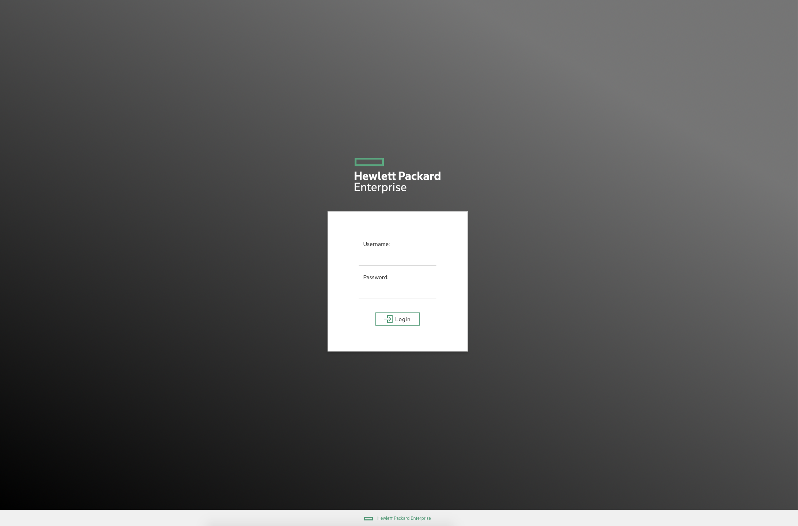
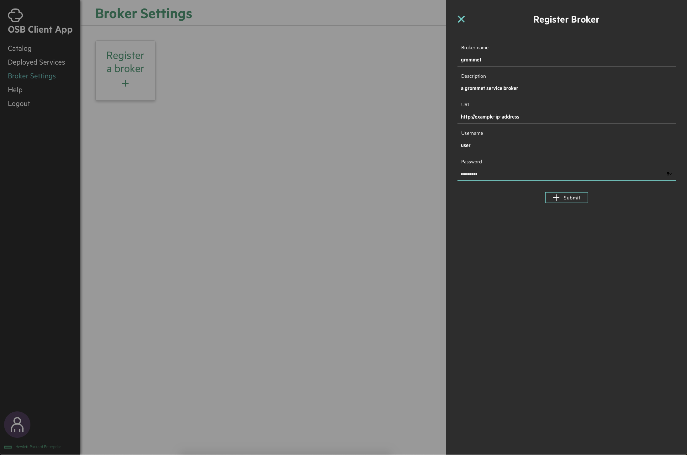
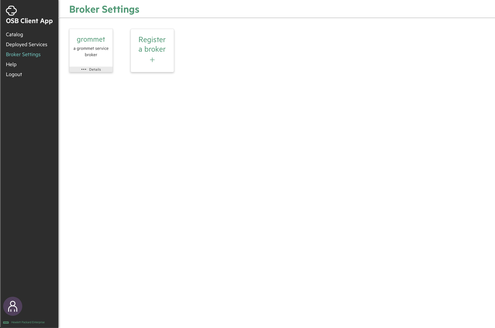
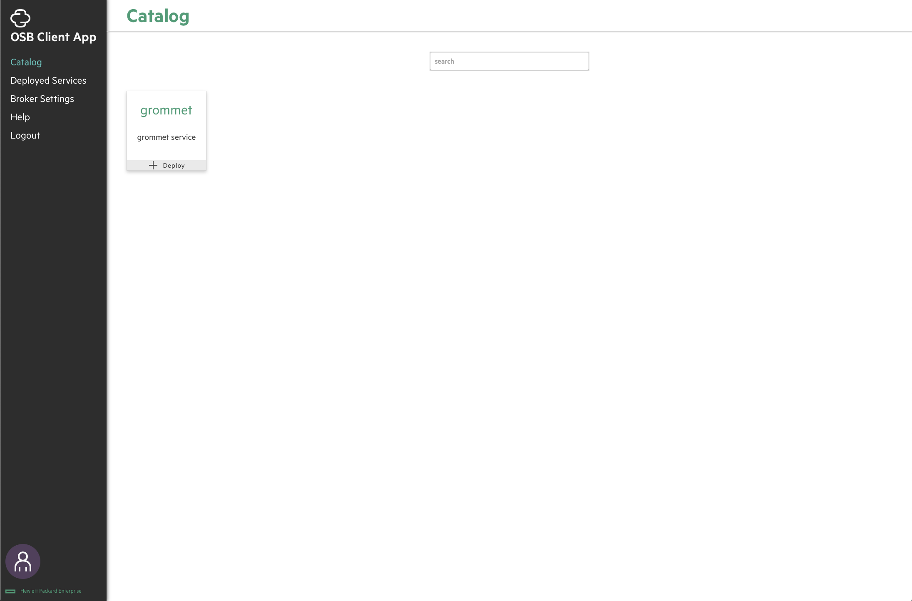
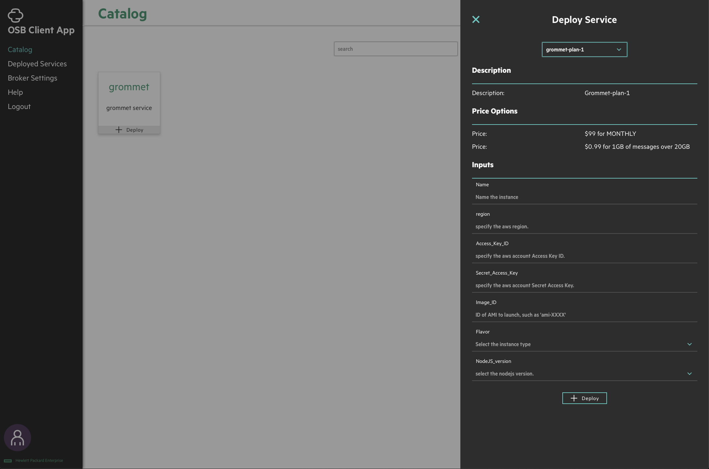
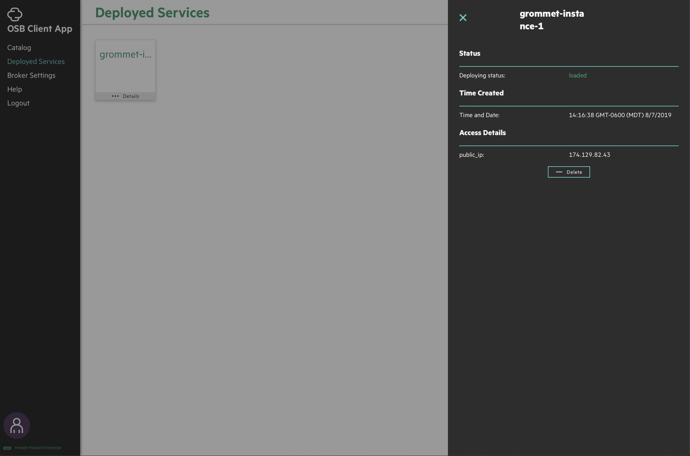

# Open Service Broker Client App

This project is a client platform for accessing services via the [_Open Service Broker API_](https://github.com/openservicebrokerapi/servicebroker/blob/master/spec.md).

Exposing services via service brokers is an easy and abstracted way of accessing service providers' offerings. This app and the OSB API hide the implementations happening behind the scenes. A service broker is a program that acts as a middleman between the service provider and the user for this abstraction. This app will be able to access and implement the services offered by any valid service broker.

It was designed and developed by interns Kailash Ramakrishnan and Carson Stone, guided by Pramod Sareddy, Peng Liu, and Alex Mejias.

## Download and Configuration:

- clone the repo:

  `git clone https://github.com/HewlettPackard/hpe-openservicebroker-clientapp`

- move to the frontend directory:

  `cd hpe-openservicebroker-clientapp/frontend/`

- install dependencies (listed in frontend/package.json):

  `yarn install`

- run the app:

  `yarn start`

## Using the App:

- login (authentication is not actually in place as of 8/7/2019, so just click log in button)
  
- register a broker
  
  
- select a service to use from the catalog
  
- chose a plan and fill in required inputs for the service
  
- deploy the instance of the selected service
- access the service instance's details
  
- after using the service, delete the service instance
